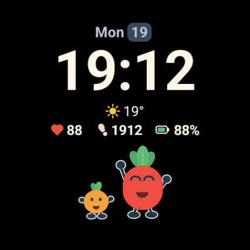
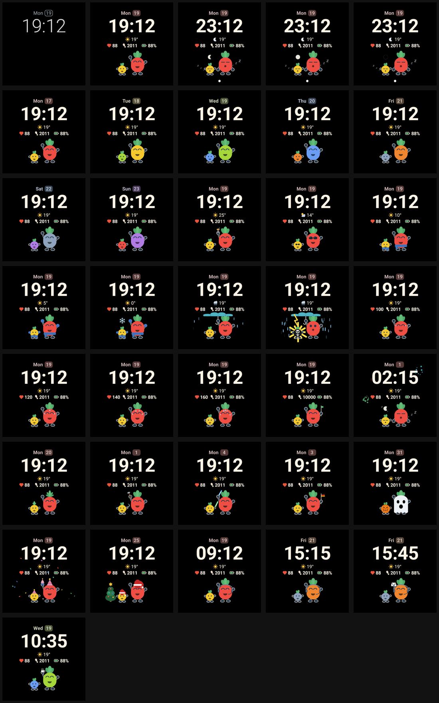

# redPlant Blob — a Pixel Watch 4 watch face


A Watch Face Format watch face built around the redPlant blob characters. It shows digital time,
weekday and day of month, weather, heart rate, steps and battery — and the two blobs react to all
of it, so the face has a mood as well as a readout.

Everything visual is declarative XML. WFF forbids code, so there is none in the APK: the blobs are
drawn from ellipses, round rectangles, arcs and capsule lines rather than bitmaps, which keeps them
sharp at any resolution and costs essentially nothing against the memory budget.

<p align="center">
  
</p>

> [!IMPORTANT]
> **v5 means Wear OS 7 in practice.** `minSdk` is still 36, so a Wear OS 6 watch will happily
> install this and then fail to render. The format had to go to v5 because `[WEATHER.*]` never
> publishes at v4. If this ever goes to anyone else, raise `minSdk` to 37 — which also means
> `compileSdk`/`targetSdk` 37 and a higher AGP pin.

## Contents

- [Quick start](#quick-start)
- [What it shows](#what-it-shows)
- [Weekday colours](#weekday-colours)
- [Reaction states](#reaction-states)
- [The meeting schedule](#the-meeting-schedule)
- [How the blobs are drawn](#how-the-blobs-are-drawn)
- [watchface.xml is generated](#watchfacexml-is-generated)
- [The preview app](#the-preview-app)
- [Verifying a build](#verifying-a-build)
- [Constraints worth knowing up front](#constraints-worth-knowing-up-front)
- [Documentation](#documentation)

## Quick start

Needs **JDK 21** (not 25 — Gradle 8.11.1's embedded Kotlin compiler dies on it while
`./gradlew --version` keeps working, so it looks fine until the first real build), the **Android
SDK** with `platform-tools`, `platforms;android-36` and `build-tools;35.0.0`, and **Node ≥ 22.18**.
Android Studio is optional; the CLI toolchain alone gives a green build.

```bash
git submodule update --init          # hhson-lib: shared rules + utils
npm ci                               # links hhson-lib, symlinks its skills, installs the toolchain
npm run verify                       # typecheck + lint + test + selftest + diff + check
./gradlew :watchface:installDebug
```

Then make it the active face without touching the watch:

```powershell
adb shell am broadcast -a com.google.android.wearable.app.DEBUG_SURFACE `
  --es operation set-watchface `
  --es watchFaceId de.redplant.watchface.blob
```

The full setup — the headless no-admin recipe, wireless `adb` pairing, and the traps in both — is in
**[docs/device.md](docs/device.md)**. The Gradle wrapper is committed (`gradlew`, `gradlew.bat`,
`gradle-wrapper.jar`, from the Gradle repo at tag `v8.11.1`), because an Android Studio sync does not
generate it and `gradle wrapper` cannot bootstrap it without a standalone Gradle to run.

## What it shows

The design canvas is **450 × 450** and the platform scales it to the device. The PW4's display is
**426 × 426** measured, so the canvas scales _down_ by ~0.95 and no per-size variant is needed. Worth
remembering when iterating in the emulator: the Wear OS round AVD is 454 × 454, about 6% larger than
the wrist.

| y range   | element                                     |
| --------- | ------------------------------------------- |
| 42 – 74   | weekday + day of month (`Sat 1`)            |
| 68 – 188  | time (`hh:mm`, follows the 12/24 h setting) |
| 184 – 216 | weather (temperature + condition)           |
| 216 – 252 | heart rate · steps · battery                |
| 262 – 392 | hero blob + companion blob                  |

**Ambient / always-on** keeps only the date and the time, thin and white on black, via
`<Variant mode="AMBIENT">`; everything else fades to alpha 0. That is both the battery-friendly
choice and roughly what the platform expects of an AOD.

Heart rate and steps are the only permission-gated sources. In practice **no prompt appears and none
is needed** — all three `android.permission.health.*` grants read `granted=false` on this watch and
both render anyway, because the WFF runtime reads the sensors and feeds the declarative face. The
`uses-permission` lines are kept in case another watch or OS version gates on them.

Weather needs a provider plus location from the paired phone or the network, not watch GPS, and it is
intermittent by nature — `IS_AVAILABLE` goes false on its own during normal use, so **every
weather-driven branch is gated on it**. That is not tidiness: with no data `TEMPERATURE` reads 0,
which satisfies `<= 10`, so an ungated cold trigger would put scarves on the blobs at every dropout.
The full picture, including what the weather bundle does and does not carry, is in
[docs/capabilities.md](docs/capabilities.md) and [docs/wff-findings.md](docs/wff-findings.md).

## Weekday colours

`[DAY_OF_WEEK]` selects the hero's body colour. Everything else in the scheme is _derived_ from it
rather than picked separately, and **the companion always wears tomorrow's hero colour** — so the
small blob previews the next day and the pair never share a hue.

| day       | hero body              | its mouth | companion (tomorrow's hero) |
| --------- | ---------------------- | --------- | --------------------------- |
| Monday    | `#ee4e43` brand red    | `#5b2622` | `#f5c92e` yellow            |
| Tuesday   | `#f5c92e` yellow       | `#594c1e` | `#a5d63a` lime green        |
| Wednesday | `#a5d63a` lime green   | `#3f4c24` | `#6b9df2` medium blue       |
| Thursday  | `#6b9df2` medium blue  | `#273f69` | `#f0862f` orange            |
| Friday    | `#f0862f` orange       | `#57381f` | `#8fa3bc` blueish grey      |
| Saturday  | `#8fa3bc` blueish grey | `#3a434d` | `#b07ce4` purple            |
| Sunday    | `#b07ce4` purple       | `#482e62` | `#ee4e43` brand red         |

The cycle closes — Sunday's companion is Monday's hero — so there is no seam in the week.

Only seven values are chosen. The mouths and the date row are computed from each in HSL, using ratios
**measured off the colours the face already had**, so Monday is unchanged to within a rounding step
and the other six inherit the same relationships:

```
mouth      body hue, S × 0.55, L × 0.41     from #ee4e43 body vs #5a2a22 mouth
date text  body hue, S 0.22,   L 0.78       from the retired ice blue #b9c6d4
date chip  body hue, S 0.20,   L 0.28       from the retired slate    #3a4757
```

A mouth that is merely "dark brown" reads as a smudge on a blue or a lime blob; a mouth that is a
dark version of the body reads as an _opening_ in it. Because the date row keeps the old scheme's
saturation and lightness exactly, only its hue moves, so nothing about the row's weight or contrast
changed.

Retheming means editing the seven `HERO` hexes in [tools/gen/palette.ts](tools/gen/palette.ts) and
regenerating. The 21 derived values are computed, and `verifyDerivation()` fails the build if a ratio
stops reproducing the colours that shipped.

> [!WARNING]
> **`[DAY_OF_WEEK]` is 1 = Sunday, not 1 = Monday.** The source is undocumented, so this was
> _measured_: a temporary `PartText` printing the raw value read `5` on Thursday. That is the
> Java/ICU `Calendar` convention, not ISO 8601 — and assuming ISO would have shifted every colour by
> a day, which looks exactly like a correct implementation six days out of seven.

Monday is the `Default` branch rather than a `Compare`, so brand red is what shows for anything
unexpected, including the `0` that `[WEATHER.*]` sources go blank with.

Two details that constrain edits here. WFF has no variables, so each of these colours is emitted at
several sites — and the dangerous ones are the **mouth masks**, since an open mouth is a dark ellipse
whose top half is repainted in the body colour. A body and mask that disagree show up as a dark bar
across the face on exactly one weekday; in the generator both take the same argument, so that is
unrepresentable rather than merely absent. And watch two collisions against the green leaf tuft
(`#4fa968` / `#5fb874`): Wednesday's lime hero and Tuesday's lime companion. The lime is deliberately
far yellower than the leaves so they still read as the darker green.

**Ambient is deliberately not coloured** — `date_ambient` stays ice blue on black, since colour costs
OLED power on a screen nobody is looking at closely and the documented ambient budget is 15% of
pixels lit.

## Reaction states



The blobs react to the data. Every accessory is an independent `<Condition>`, so they **stack** — a
wet night shows both sleeping blobs and the umbrella — and the only thing deciding what covers what
is document order.

**Eight of them are calendar dates**, and those eight are mutually exclusive by construction: a
build-time proof in `tools/gen/states.ts` walks all 372 possible month/day pairs and fails if any
day belongs to two occasions, or if any predicate fires on a day its own `HOLIDAY` row does not
name. They still stack with the weather — a snowflake over a Santa hat is a state the watch can be
in, and it is meant to be.

These are the names the tooling knows each state by — pass any of them to `mock-state.ts`,
`capture-states.ts --only=` or `cycle-states.ts --only=`.

| state           | trigger                                                                 |
| --------------- | ----------------------------------------------------------------------- |
| `ambient`       | display mode, not data                                                  |
| `baseline`      | nothing firing                                                          |
| `night`         | `HOUR_0_23 >= 23 \|\| HOUR_0_23 < 7`                                    |
| `sunny`         | `CONDITION == 1 && IS_DAY && TEMPERATURE >= 25` — cocktail              |
| `uv`            | `UV_INDEX >= 3 && IS_DAY` — sunglasses                                  |
| `cold`          | `TEMPERATURE <= 10` — scarf                                             |
| `gloves`        | `TEMPERATURE <= 5` — adds mittens                                       |
| `freezing`      | `TEMPERATURE <= 0` — adds a snowflake                                   |
| `rainy`         | `CHANCE_OF_PRECIPITATION >= 50` — umbrella + falling rain               |
| `thunderstorm`  | `CHANCE_OF_PRECIPITATION >= 90` — bolt, burst, X-ray                    |
| `downpour`      | 100% — the rain field at full density. No frame; motion only            |
| `sweating`      | `HEART_RATE >= 100` — drips begin, forehead still bare                  |
| `puffing`       | `HEART_RATE >= 120` — the middle forehead pearl                         |
| `flushed`       | `HEART_RATE >= 140` — the outer pair, replacing it                      |
| `soaked`        | `HEART_RATE >= 160` — all three pearls, second drip fades in            |
| `drenched`      | 200 bpm — the fastest, furthest drip. No frame; motion only             |
| `goal`          | `STEP_PERCENT >= 100` against the wearer's real `STEP_GOAL` — a flag    |
| `fireworks`     | `MONTH == 1 && DAY == 1 && HOUR_0_23 < 4` — New Year's small hours      |
| `weed`          | 20 Apr — both leaf tufts fan into a cannabis leaf. All day              |
| `labour`        | 1 May — hammer and sickle, leaning towards each other                   |
| `force`         | 4 May — two lightsabers, and the hero glares                            |
| `reunification` | 3 Oct — the German tricolour replaces the pennant on the goal pole      |
| `halloween`     | 31 Oct — the hero wears a sheet, the companion a pumpkin                |
| `birthday`      | 19 Dec — cake with a lit candle, party hats, and confetti               |
| `christmas`     | `MONTH == 12 && DAY >= 24 && DAY <= 26` — Santa hats and a tree         |
| `headset`       | digital standup, `09:05–09:20` and `16:00–16:30` — hero only, no hand   |
| `headsetfri`    | Friday's game-time window, `15:00–15:30` — headset, hand still empty    |
| `fricontroller` | Friday `15:30–16:00` — a controller replaces the empty hand             |
| `wedcoffee`     | the in-person standup, `10:30–10:45` — no headset, a coffee cup instead |
| `wedcoffeehot`  | that standup on a hot, sunny day — proves the one-prop priority         |

Some of these are **sub-states of the one above**, not new mechanisms. "Sunny" is really two
Conditions: the sunglasses answer `WEATHER.UV_INDEX` (3 is the bottom of "moderate" on the WHO/EPA
scale) while the cocktail wants a warm clear sky, so a bright cold March afternoon gets shades and no
drink. Cold splits the same way, and the four sweat states are one ramp sampled four times.

The two Conditions are independent, so a hot high-UV day really does get both. The `sunny` **frame**
nonetheless keeps its UV under the gate and shows the cocktail alone, because a frame that fires two
triggers documents neither — nothing in it says which one owns which prop. `uv` is the sunglasses'
frame.

Seven weekday states (`monday` … `sunday`) sit outside this list — they are a theme dimension rather
than a reaction, each the baseline face differing only in hue.

Cold's steps are strict subsets of one another, so nothing has to exclude anything — 3° is scarf
_and_ gloves _and_ snowflake. The sweat bands are **not** subsets: the middle pearl is deliberately
absent from the 120–149 band, which is what makes the pearl count read 1 → 2 → 3 rather than
1 → 3 → 3.

**Two reactions are continuous ramps rather than states**, and the table flattens them: rain scales
with `CHANCE_OF_PRECIPITATION`, sweat with `HEART_RATE`. Their rows are sample points, not switches.
A **moon phase** also appears in the gap above the companion at night, which the snowflake displaces
when it is freezing.

**One prop at a time.** The coffee cup, the game controller and the cocktail all anchor to the same
fist, so only one of the three is ever drawn — see [the meeting schedule](#the-meeting-schedule).

### Motion

None of it is visible in a still. The blobs shift with wrist tilt via `<Gyro>` over the accelerometer
(±8px on the hero, ±5.5 on the companion — the ratio is what reads as depth); the Zzz drift upward
while fading, the two sets a second out of phase; rain falls whenever the umbrella is up; and sweat
beads run down both cheeks, faster and in greater number the higher the heart rate.

**Rain — 24 independent drops.** Every drop has its own track, start height, fall length, rate,
phase, size and precipitation threshold; nothing is shared between any two, so there is no wave
structure and the field's period is the lcm of 24 cycles. Drop **count, size and speed all scale with
`CHANCE_OF_PRECIPITATION`** off one term, `g = clamp((precip - 50) / 50, 0, 1)`: about 7 drops at the
50% gate against 24 at 100%, 3.0–3.8px wide against 3.9–4.9, and 66–74 px/s against 89–100. Count
comes from each drop carrying its own threshold folded into the alpha it already had, so drops _fade_
in as the chance rises instead of popping.

The two columns **bracket the umbrella canopy** — it spans x 137–297, and no drop ends after 137 on
the left or starts before 297 on the right, so the wet strips are exactly what the canopy does not
cover and the dry band between them is its shadow. Drops deliberately cross the raised hand, the
step-goal flag, both Zzz chains and the burst's outer spokes, all at the correct depth. The one line
held is that **no drop crosses either blob's body** — they are the characters.

**Sweat.** Drips scale linearly from 100 bpm to 200 —
`travel = 12 + 18 * clamp((HEART_RATE - 100) / 100, 0, 1)` — and since the period is fixed, travel is
also speed (6 px/s at the floor, 15 at the ceiling). Heart rate drives the drip _rate_ as well as its
reach, from a bead every five seconds at 100 to one every 1.7 at 200. A second bead per cheek fades
in across 140–160, and the static forehead cluster fills in three steps.

Every drop and drip stays inside the round bezel at full travel, checked per element rather than in
aggregate, because the outer tracks sit lowest in the display's taper: worst case is radius 213
of 225.

Accessories that _attach_ to a blob — umbrella, bolt, burst, both sets of z's — each repeat their
blob's Gyro gain, because they are siblings of the blob groups rather than children and inherit
nothing. **Changing a blob's gain means changing every accessory that tracks it.** The snowflake, the
moon and the rain deliberately have none: they float, so holding them still is what puts them in the
sky. Sweat drips need no repetition — they live inside the blob groups.

Every animation runs off `[SECOND_MILLISECOND]`. There is **no `[ANIMATION_VALUE]` source**, and
`<Animation>` is a tween rather than a clock. Two phase formulas are in use:

```
p = (([SECOND] % N) + [SECOND_MILLISECOND] - [SECOND]) / N     # Zzz, sweat drips
p = fract([SECOND_MILLISECOND] * rate + offset)                # rain
```

The first offers offsets in **whole seconds** only, which couples the number of distinct phases to
the period. `fract()` is verified on this watch and removes that constraint — any offset, any rate —
with the catch that **`60 × rate` must be a whole number**, since `[SECOND_MILLISECOND]` wraps
59.999 → 0. That is why the rain scales its speed through _travel_ and never through rate. Details
and the verification method are in [docs/wff-findings.md](docs/wff-findings.md).

### Reviewing states

`tools/mock-state.ts` patches the **data** — temperature, hour, heart rate — into `watchface.xml` and
lets the real Conditions evaluate, so states that nest do so in the snapshots too. Every snapshot
shows the same 19:12 / Mon 19 / 88 bpm / 2011 steps / 88% except for the one value that state is
about.

```bash
node tools/capture-states.ts                     # photograph every state into docs/states/
node tools/capture-states.ts --only=gloves       # one; follow with --sheet-only
node tools/cycle-states.ts                       # show them on the wrist, looping
node tools/cycle-states.ts --only=rainy,thunderstorm,night

# any point BETWEEN the named states — rain and sweat are ramps, not switches
node tools/mock-state.ts on sweating --set=HEART_RATE=150 --live
```

`capture-states.ts` photographs states; `cycle-states.ts` _shows_ them. **`--live` matters**: a plain
mock pins the accelerometer and the clock so snapshots stay byte-comparable, which also switches off
the parallax and the drift.

The frozen clock in a mock is chosen so animations are _visible_ in a still, which is why `SECOND` is
1 and `SECOND_MILLISECOND` is 1.0 rather than 0. Every alpha here is zero at both ends of its cycle,
so **a phase landing on 0 at that instant renders nothing at all** — the constant is load-bearing,
and anything new with a periodic alpha has to be checked against it or its frame comes out empty.

For accessory parallax the states that matter are **rainy** (umbrella in the fist), **thunderstorm**
(bolt tip inside the burst spoke) and **nightfull** (two Zzz chains 150px apart); the rest are a
control.
Also worth holding: **rainy at night with the step goal met**, the busiest frame the face can produce
and the one the rain's placement was chosen against.

<details>
<summary><b>How <code>docs/states/</code> is named and ordered</b></summary>

Screenshots live in [docs/states/](docs/states/) with `all-states.png` as the contact sheet, **five
thumbnails to a row**. It opens with the setup — ambient, the baseline, the three moon phases and the
**seven weekday frames** — and every reaction follows. The weekday frames are a theme dimension
rather than reactions, and all seven are kept rather than a sample because the pairing is the point:
the only way to check the cycle closes is to see Sunday's companion match Monday's hero. They sit
third because Monday is what every frame below them holds fixed.

**Night is photographed three times**, at a half, a full and a new moon, because the moon mark is the
one element driven by a source nothing can provoke — `MOON_PHASE_POSITION` advances the shadow 1.6px
a day across a 24px disc — so a single frame documents one arbitrary night of twenty-nine.

**The digits in a file name exist so a file explorer lists the frames in reading order, and for
nothing else.** They are a flat, zero-padded run — `01-baseline`, `02-night-half-moon`, … — derived
from an entry's position in `CAPTURE_ORDER`
([tools/gen/data/capture-states.ts](tools/gen/data/capture-states.ts)), which is the only place the
order is written down. Inserting a state is a one-line source edit; the whole sequence renumbers
itself and **a full sweep recalculates the names on disk**, writing the new ones and pruning the old.
The weekday frames are rows of that same list — they used to be `w-monday` … `w-sunday`, which sorted
all seven after `all-states.png` and gave the directory two naming schemes to explain. Only their
state names are derived from `STATES`, so they cannot be typed twice.

There are **no letter suffixes**. Sub-states used to be lettered off a base — `4-cold`, `4b-gloves` —
which encoded a claim the file name is the wrong place for: whether two reactions share a slot is a
judgement, it drifted, and it made the cost of inserting a state depend on where you inserted it. A
flat run has one rule and no judgement in it. The padding is fixed at two digits because unpadded
numbers did not actually sort — `ls`, git and GitHub's file listing are lexicographic, and put
`10-fireworks` between `1-baseline` and `2-night`. Only Windows Explorer's natural sort hid it.

> [!NOTE]
> **Nothing outside `docs/states/` should refer to a state by its number.** The number is positional
> and recalculated on every sweep, so every reference to it goes stale silently. Both capture and
> cycle tools take the **state name** — `gloves`, not `05-gloves` — and so does this README.

One consequence of the numbering being positional: a partial sweep (`--only`) will not notice the
names are stale, because the renumber and the orphan prune only run on a full one. And **the contact
sheet's order comes from the declaration order, not from the filenames**, which is a correction
rather than a preference — it predates the padding, and it stays because the declaration is the
authority either way.

The step-goal flag gets its own frame even though it is a mark rather than a state, because unlike
the snowflake and the moon it appears in no other frame — and a reaction with no screenshot gets
taken for a reaction that was never built. `downpour` (100%) and `drenched` (200 bpm) deliberately
have no frame: what they add over the frame below them is motion, which a still cannot hold, so they
live in `cycle-states.ts` instead.

</details>

## The meeting schedule

Four windows, defined once in [tools/gen/meetings.ts](tools/gen/meetings.ts) and restated at every
site that reacts to them — WFF gives no way to reference one Condition's expression from another.

|                    | window      | the hero gets                                           |
| ------------------ | ----------- | ------------------------------------------------------- |
| Mon, Tue, Thu, Fri | 09:05–09:20 | a headset                                               |
| Mon, Tue, Thu      | 16:00–16:30 | a headset                                               |
| Friday             | 15:00–16:00 | a headset throughout, plus a game controller from 15:30 |
| Wednesday          | 10:30–10:45 | **no headset** — a coffee cup instead                   |

Windows are half-open (09:05:00 through 09:19:59). Wednesday is excluded from both digital windows on
purpose rather than folded into a range: `MON_TUE_THU_FRI` and `MON_TUE_THU` are each an explicit
`OR` of the days they cover, because "which days" is what a reader needs at a glance, and a
range-with-a-hole makes them do the subtraction.

**The prop collision is resolved without negation.** A hot, sunny Wednesday standup would otherwise
want both a coffee cup and a cocktail in the same fist. One `Condition`, three `Compare`s, coffee and
controller listed _ahead_ of the cocktail: the cocktail's own branch then means "hot and sunny AND
NOT coffee-time AND NOT controller-time" for free, no De Morgan required. `wedcoffeehot` in
`mock-state.ts` mocks exactly that overlap.

**The headset is the only accessory that crosses the head** rather than sitting beside it, which
raises a question nothing else does: what happens to the leaf tuft and the forehead sweat pearls,
which occupy almost the same pixels. Resolved by draw order rather than by carving the shape around
them — the headset Condition is added before the hand-prop one, so it draws behind whatever is in the
hand but in front of the leaf and the pearls, which is what a headband worn over hair actually looks
like.

The companion sits these out for now; its headset is scrapped until the hero's shape is judged final.

> [!CAUTION]
> `or(a, b, c, d)` builds a flat `a || b || c || d` with no parentheses of its own, and ANDing that
> parses as `a || b || (d && …)` because `&&` binds tighter. The symptom here was two weekdays
> showing a headset at _every_ hour. **Any `or()` later combined with `and()` needs `group()` around
> it** — reading the expression looks correct, so this is caught by evaluating the emitted text. See
> [docs/authoring.md](docs/authoring.md).

## How the blobs are drawn

Worth knowing before editing them, because WFF has **no `<Path>` element**:

- **Body** — `RoundRectangle` with corner radii near half the width.
- **Leaf tuft** — three `PartDraw` layers, each rotated via `angle` about `pivotX`/`pivotY`. Each
  leaf's box is an oversized 80 × 80 square centred on the tuft base, so rotation never clips it.
- **Open mouth** — a dark `Ellipse` with its top half painted back over in the body colour. `Arc`
  accepts only `Stroke`, never `Fill`, so a filled half-moon has to be faked. **The mask must
  overshoot the shape it cuts** — start it ~3px above the ellipse. Both mouths originally started
  flush, their antialiased top edges did not cancel, and the surviving 1px sliver read convincingly
  as a little nose.
- **Closed happy eyes** — stroked `Arc`. There is **no `sweepAngle`**; both `startAngle` and
  `endAngle` are required. Angle 0 is 12 o'clock sweeping clockwise, so the upper half is
  `270 → 450`, deliberately left past 360 rather than wrapped, so the sweep stays unambiguously
  positive.
- **Limbs** — `Line` with `cap="ROUND"` plus a small filled `Ellipse` for the hand or foot, which is
  exactly how the CI illustrations are constructed.

## watchface.xml is generated

`watchface/src/main/res/raw/watchface.xml` is a **build artifact** produced from `tools/gen/*.ts`.
Edit the TypeScript, then regenerate — a hand edit to the XML survives until the next build and then
vanishes.

```bash
npm run gen                         # regenerate watchface.xml
npm run verify                      # the whole gate
npm run diff                        # prove it still renders the same as the baseline
npm run selftest                    # prove the differ can still fail
node tools/gen/build.ts --equiv "<a>" "<b>"   # do two expressions agree over the grid?
```

**The gate is a semantic differ, not a byte comparison.** `tools/gen/model.ts` compares draw order,
tags, attributes and text against the committed baseline `tools/gen/face.model.json`, normalising
away comments, whitespace and `1.0` vs `1`. A pure refactor must leave `npm run diff` empty; when a
rendering change is intended, `--snapshot` accepts it and the new baseline lands in the same commit
as the change that caused it.

There is also a **byte** check, `npm run check`, which the semantic differ does not replace: passing
_without_ regenerating proves a refactor changed nothing at all, which is a stronger claim than
"renders the same". `:watchface:validateWatchFaceXml` depends on it, so a stale committed file fails
the build rather than shipping.

Design prose lives as TSDoc on the constants it explains rather than as comments in the output, and
the palette table in the generated header is computed from `palette.ts` — so the documentation of the
colours cannot drift from the colours.

<details>
<summary><b>Where things live in <code>tools/gen/</code></b></summary>

| file                 | holds                                                                                             |
| -------------------- | ------------------------------------------------------------------------------------------------- |
| `palette.ts`         | the 7 chosen weekday hexes; the other 21 are derived by HSL ratio                                 |
| `geometry.ts`        | every named box, plus `ANCHORS` — where each section sits on the canvas                           |
| `expr.ts`            | the closed `Source` union and the ramp / phase / triangle idioms                                  |
| `states.ts`          | the named predicates and the `T` threshold table                                                  |
| `condition.ts`       | `when()` / `whenElse()` / `switchOn()`, replacing hand-written scaffolds                          |
| `type.ts`            | `FONT_FAMILY`, the type scale, and `font()`                                                       |
| `crossfade.ts`       | `AMBIENT_HIDE` and the two fade windows, with the asymmetry argument                              |
| `weekday.ts`         | `byWeekday()`, the seven-way fan-out                                                              |
| `blob.ts`, `chip.ts` | shared primitives; the two blobs stay separate call sequences                                     |
| `meetings.ts`        | the meeting windows                                                                               |
| `data/*.ts`          | row tables — blobs, props, weather, chips, zzz, fireworks, celebrations                           |
| `face/*.ts`          | 22 sections in draw order, plus `costumes.ts` and `saber.ts`, shared by both blobs. Builders only |
| `eval.ts`            | a WFF expression interpreter, shared by `--equiv` and the preview                                 |
| `fixtures.ts`        | `BASE` plus the named states, shared by `mock-state.ts` and the preview                           |
| `model.ts`           | the semantic model the differ compares                                                            |
| `xml.ts`, `svg.ts`   | the two serialisers                                                                               |
| `tools/preview/`     | the Svelte app. Its own `package.json`; `npm run verify` never touches it                         |

</details>

## The preview app

**`watchface.xml` is not the only compilation target.** `face()` returns `Node[]` and `serialize()`
is a pure function of it, so a second pure function of the same tree renders it to SVG instead
(`tools/gen/svg.ts`). `npm run preview` puts that behind a Svelte app with a state picker, a
scrubbable clock, an ambient transition scrubber and a tilt pad — so a change can be seen in a
browser instead of costing a Gradle build, an install, a broadcast and a wake.

```bash
cd tools/preview && npm install     # once, isolated from the root package.json
npm run preview                     # the authoring loop
npm run preview:check               # prove the preview animates, clamps, clips and crossfades
node tools/gen/build.ts --svg       # the same renderer, straight to a file
```

It is **not pixel truth** — text metrics belong to the device, the easing curves are approximated,
and its scale is a fourth geometry alongside 450 / 426 / 454. The wrist stays the arbiter.

## Verifying a build

`npm run verify` is the generator's own gate. Two further checks run on the Gradle side, from jars
published by [google/watchface](https://github.com/google/watchface):

| file                         | task                              | what it checks                       |
| ---------------------------- | --------------------------------- | ------------------------------------ |
| `tools/wff-validator.jar`    | `:watchface:validateWatchFaceXml` | XML against the v5 schema            |
| `tools/memory-footprint.jar` | `:watchface:checkMemoryFootprint` | 10 MB ambient / 100 MB active limits |

> [!WARNING]
> Both jars are `.gitignore`d, so **a clone does not have them** — and both tasks are `onlyIf`-gated
> on the jar existing, so without them they log one `Skipping:` line and the build **still reports
> `BUILD SUCCESSFUL`**. Look for the `PASSED` / `PASS` lines, not the build result.

**A green validator run proves less than it looks like.** `Variant/@target`, `Transform/@target` and
the whole arithmetic expression type are plain `xs:string`, so a misspelled target or outright
nonsense passes validation and is then silently ignored at runtime. Anything expression-level has to
be seen on the watch. This face uses no bitmaps and no embedded fonts, so the memory footprint is
effectively the font alone.

`submodules/hhson-lib` is a git submodule carrying shared coding rules and a small TypeScript utility
library, imported flat from the bare specifier `hhson-lib`. It resolves through a `file:` dependency,
which is what makes that specifier work under plain `node`, under `tsc` and under Vite. Two
strictness flags are relaxed to match its tsconfig — `noUncheckedIndexedAccess` and
`exactOptionalPropertyTypes` — with the reasoning written out in `tsconfig.json`.

## Constraints worth knowing up front

- **No code, no network, no custom data.** Dynamic values come only from the platform data sources or
  from complications provided by other apps.
- **No loops and no state between frames.** Expressions are arithmetic and conditional only. The
  operator set _does_ include `<`, `<=` and `!=`, verified on the watch — the XSD enumeration that
  omits them is neither authoritative nor enforced.
- **No `<Path>` and no SVG.** Five primitives, in every format version; arbitrary shapes must be
  pre-rendered to PNG.
- **No `[IS_AMBIENT]` source**, so no `<Transform>` can track ambient state. Ambient is reachable
  only through `<Variant mode="AMBIENT">`.
- **`Font/@weight` is a closed 12-value enum** with no variable-font axis, and it is not
  transformable. The stock face's smooth weight morph is native render code and cannot be reproduced.
- **Ambient updates roughly once a minute**, so no sweeping second hand there.
- **The charging screen is not yours.** Docking hands the display to privileged system UI; the face
  is not rendered at all.
- **Debugging is guess-and-check** — a code-free APK produces no logs.

The complete inventory of what v5 offers and what this face uses is
[docs/capabilities.md](docs/capabilities.md), including a ranked list of the unused features worth
acting on.

## Documentation

| file                                         | answers                                                   |
| -------------------------------------------- | --------------------------------------------------------- |
| [docs/capabilities.md](docs/capabilities.md) | what WFF v5 offers and what of it this face uses          |
| [docs/wff-findings.md](docs/wff-findings.md) | how WFF and this watch actually behave, measured          |
| [docs/authoring.md](docs/authoring.md)       | how to change the face: `tools/gen/`, the gate, the rules |
| [docs/device.md](docs/device.md)             | toolchain, install, capture, and the traps in all three   |
| [docs/decisions/](docs/decisions/)           | why a structural choice was made, dated                   |
| [CHANGELOG.md](CHANGELOG.md)                 | what changed and when                                     |
| [TODO.md](TODO.md)                           | what is still open                                        |
| [CLAUDE.md](CLAUDE.md)                       | the always-on rules, and which skill to load when         |
